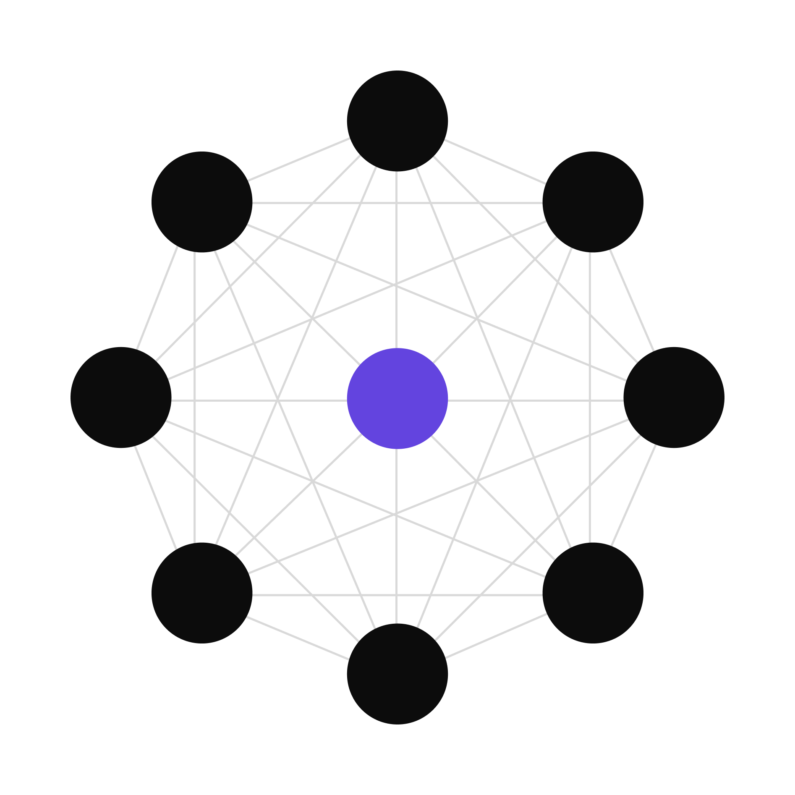
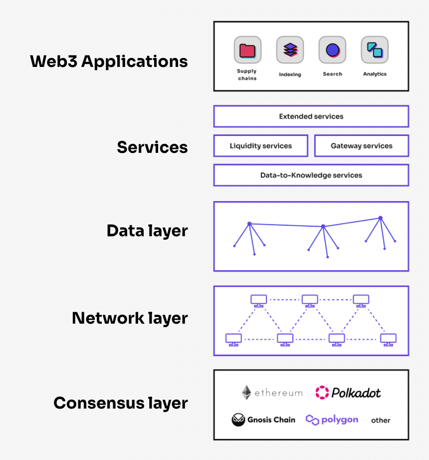
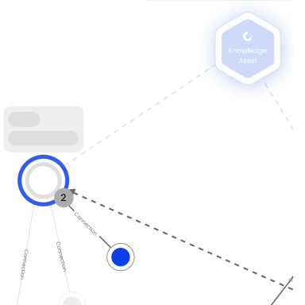
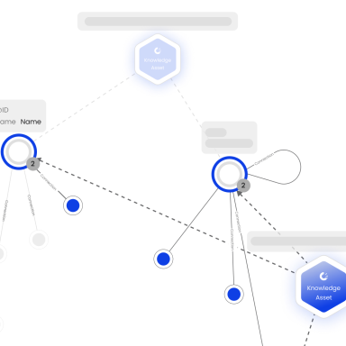
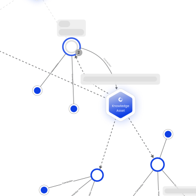
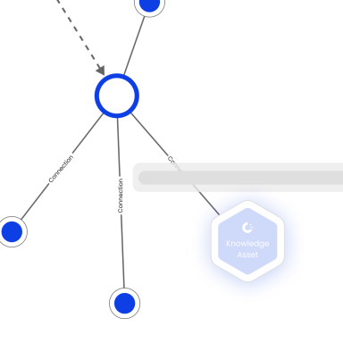
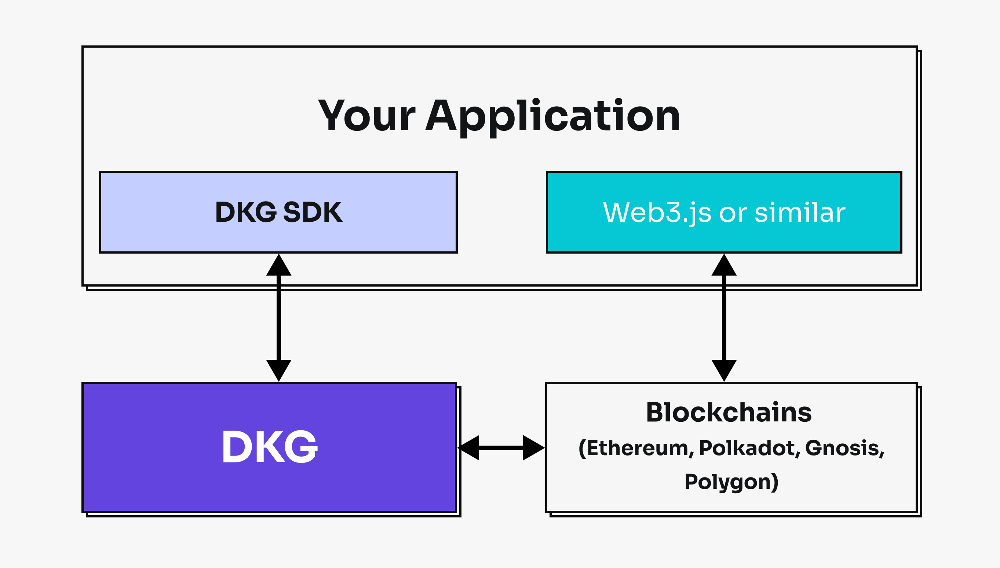

<a name="readme-top"></a>

---

<br />
<div align="center">
  <a href="https://github.com/OriginTrail/ot-node">
    
  </a>

  <h3 align="center"><b>OT-Node</b></h3>

  <p align="center">
    </br>
    <a href="https://docs.origintrail.io/">OriginTrail Docs</a>
    ·
    <a href="https://github.com/OriginTrail/ot-node/issues">Report Bug</a>
    ·
    <a href="https://github.com/OriginTrail/ot-node/issues">Request Feature</a>
  </p>
</div>

</br>

<details open>
  <summary>
    <b>Table of Contents</b>
  </summary>
  <ol>
    <li>
      <a href="#📚-about-the-project">📚 About The Project</a>
      <ul>
        <li><a href="#what-is-the-decentralized-knowledge-graph">What is the Decentralized Knowledge Graph?</a></li>
        <li><a href="#the-origintrail-dkg-architecture">The OriginTrail DKG Architecture</a></li>
        <li><a href="#what-is-a-knowledge-asset">What is a Knowledge Asset?</a></li>
      </ul>
    </li>
    <li>
      <a href="#🚀-getting-started">🚀 Getting Started</a>
      <ul>
        <li><a href="#prerequisites">Prerequisites</a></li>
        <li><a href="#local-network-setup">Local Network Setup</a></li>
        <li><a href="#dkg-node-setup">DKG Node Setup</a></li>
        <li><a href="#build-on-dkg">Build on DKG</a></li>
      </ul>
    </li>
    <li><a href="#📄-license">📄 License</a></li>
    <li><a href="#🤝-contributing">🤝 Contributing</a></li>
    <li><a href="#📰-social-media">📰 Social Media</a></li>
  </ol>
</details>

---

<br/>

## 📚 About The Project

<details open>
<summary>

### **What is the Decentralized Knowledge Graph?**

</summary>

<br/>

<div align="center">
    
</div>

OriginTrail Decentralized Knowledge Graph (DKG), hosted on the OriginTrail Decentralized Network (ODN) as trusted knowledge infrastructure, is shared global Knowledge Graph of Knowledge Assets. Running on the basis of the permissionless multi-chain OriginTrail protocol, it combines blockchains and knowledge graph technology to enable trusted AI applications based on key W3C standards.

</details>

<details open>
<summary>

### **The OriginTrail DKG Architecture**

</summary>

<br/>

The OriginTrail tech stack is a three layer structure, consisting of the multi-chain consensus layer (OriginTrail layer 1, running on multiple blockchains), the Decentralized Knowledge Graph layer (OriginTrail Layer 2, hosted on the ODN) and Trusted Knowledge applications in the application layer.

<div align="center">
    
</div>

Further, the architecture differentiates between **the public, replicated knowledge graph** shared by all network nodes according to the protocol, and **private Knowledge graphs** hosted separately by each of the OriginTrail nodes.

**Anyone can run an OriginTrail node and become part of the ODN, contributing to the network capacity and hosting the OriginTrail DKG. The OriginTrail node is the ultimate data service for data and knowledge intensive Web3 applications and is used as the key backbone for trusted AI applications (see https://chatdkg.ai)**

</details>

<details open>
<summary>

### **What is a Knowledge Asset?**

</summary>

<br/>

<div align="center">
    
</div>

**Knowledge Asset is the new, AI‑ready resource for the Internet**

Knowledge Assets are verifiable containers of structured knowledge that live on the OriginTrail DKG and provide:

-   **Discoverability - UAL is the new URL**. Uniform Asset Locators (UALs, based on the W3C Decentralized Identifiers) are a new Web3 knowledge identifier (extensions of the Uniform Resource Locators - URLs) which identify a specific piece of knowledge and make it easy to find and connect with other Knowledge Assets.
-   **Ownership - NFTs enable ownership**. Each Knowledge Asset contains an NFT token that enables ownership, knowledge asset administration and market mechanisms.
-   **Verifiability - On-chain information origin and verifiable trail**. The blockchain tech increases trust, security, transparency, and the traceability of information.

By their nature, Knowledge Assets are semantic resources (following the W3C Semantic Web set of standards), and through their symbolic representations inherently AI ready. See more at https://chatdkg.ai
<br/>

**Discover Knowledge Assets with the DKG Explorer:**

<div align="center">
    <table>
        <tr>
            <td align="center">
                <a href="https://dkg.origintrail.io/explore?ual=did:dkg:otp/0x5cac41237127f94c2d21dae0b14bfefa99880630/309100">
                  
                </a>
                <br><b>Supply Chains</b>
            </td>
            <td align="center">
                <a href="https://dkg.origintrail.io/explore?ual=did:dkg:otp/0x5cac41237127f94c2d21dae0b14bfefa99880630/309285">
                  
                </a>
                <br><b>Construction</b>
            </td>
            <td align="center">
                <a href="https://dkg.origintrail.io/explore?ual=did:dkg:otp/0x5cac41237127f94c2d21dae0b14bfefa99880630/309222">
                  
                </a>
                <br><b>Life sciences and healthcare</b>
            </td>
            <td align="center">
                <a href="https://dkg.origintrail.io/explore?ual=did:dkg:otp/0x5cac41237127f94c2d21dae0b14bfefa99880630/308028">
                  
                </a>
                <br><b>Metaverse</b>
            </td>
        </tr>
    </table>
</div>

</details>

<p align="right">(<a href="#readme-top">back to top</a>)</p>
<br/>

## 🚀 Getting Started

---

### Prerequisites

<br/>

-   **Node.js** 20.18
-   **npm** 10.8.2

---

<br/>

### Local Network Setup

<br/>

First, clone the repo:

```bash
git clone https://github.com/OriginTrail/ot-node.git
cd ot-node
```

Switch the branch to `v8/develop`:

```bash
git checkout v8/develop
```

Install dependencies using `npm`:

```bash
npm install
```

Create the .env file inside the "ot-node" directory:

```bash
nano .env
```

and paste the following content inside (save and close):

```bash
NODE_ENV=development
RPC_ENDPOINT_BC1=http://localhost:8545
RPC_ENDPOINT_BC2=http://localhost:9545
```

Run the Triple Store.

To use default Triple Store (`blazegraph`), download the exec file and run it with the following command in the separate process:

```bash
java -server -Xmx4g -jar blazegraph.jar
```

Then, depending on the OS, use one of the scripts in order to run the local network with provided number of nodes (minimal amount of nodes should be 6):

**MacOS**

```bash
bash ./tools/local-network-setup/setup-macos-environment.sh --nodes=6
```

**Linux**

```bash
./tools/local-network-setup/setup-linux-environment.sh --nodes=6
```

---

<br/>

### DKG Node Setup

<br/>

In order to run a DKG node on the **V8 Testnet**, please read the official documentation: https://docs.origintrail.io/dkg-v8-upcoming-version/run-a-v8-core-node-on-testnet

---

<br/>

### Build on DKG

<br/>

The OriginTrail SDKs are client libraries for your applications, used to interact and connect with the OriginTrail Decentralized Knowledge Graph.
From an architectural standpoint, the SDK libraries are application interfaces into the DKG, enabling you to create and manage Knowledge Assets through your apps, as well as perform network queries (such as search, or SPARQL queries), as illustrated below.

<div align="center">
    
</div>

The OriginTrail SDK libraries are being built in various languages by the team and the community, as listed below:

-   dkg.js - V8 JavaScript SDK implementation
    -   [Github repository](https://github.com/OriginTrail/dkg.js/tree/v8/develop)
    -   [Documentation](https://docs.origintrail.io/dkg-v8-upcoming-version/v8-dkg-sdk/dkg-v8-js-client)
-   dkg.py - V8 Python SDK implementation
    -   [Github repository](https://github.com/OriginTrail/dkg.py/tree/v8/develop)
    -   [Documentation](https://docs.origintrail.io/dkg-v8-upcoming-version/v8-dkg-sdk/dkg-v8-py-client)

---

<br/>
<p align="right">(<a href="#readme-top">back to top</a>)</p>

## 📄 License

Distributed under the Apache-2.0 License. See `LICENSE` file for more information.

<br/>
<p align="right">(<a href="#readme-top">back to top</a>)</p>

## 🤝 Contributing

Contributions are what make the open source community such an amazing place to learn, inspire, and create. Any contributions you make are **greatly appreciated**.

If you have a suggestion that would make this better, please fork the repo and create a pull request. You can also simply open an issue with the tag "enhancement".
Don't forget to give the project a star! Thanks again!

1. Fork the Project
2. Create your Feature Branch (`git checkout -b feature/AmazingFeature`)
3. Commit your Changes (`git commit -m 'Add some AmazingFeature'`)
4. Push to the Branch (`git push origin feature/AmazingFeature`)
5. Open a Pull Request

<br/>
<p align="right">(<a href="#readme-top">back to top</a>)</p>

## 📰 Social Media

<br/>

<div align="center">
  <a href="https://medium.com/origintrail">
    
  </a>
  <a href="https://t.me/origintrail">
    
  </a>
  <a href="https://x.com/origin_trail">
    
  </a>
  <a href="https://www.youtube.com/c/origintrail">
    
  </a>
  <a href="https://www.linkedin.com/company/origintrail/">
    
  </a>
  <a href="https://discord.gg/cCRPzzmnNT">
    
  </a>
  <a href="https://www.reddit.com/r/OriginTrail/">
    
  </a>
  <a href="https://coinmarketcap.com/currencies/origintrail/">
    
  </a>
</div>

---
