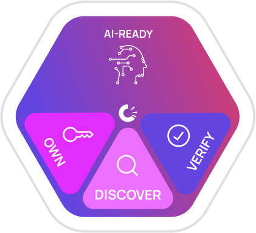

<a name="readme-top"></a>

___

<br />
<div align="center">
  <a href="https://github.com/OriginTrail/dkg.py">
    
  </a>

  <h3 align="center"><b>OT-Node</b></h3>

  <p align="center">
    </br>
    <a href="https://docs.origintrail.io/">OriginTrail Docs</a>
    ·
    <a href="https://github.com/OriginTrail/ot-node/issues">Report Bug</a>
    ·
    <a href="https://github.com/OriginTrail/ot-node/issues">Request Feature</a>
  </p>
</div>

</br>

<details open>
  <summary>
    <b>Table of Contents</b>
  </summary>
  <ol>
    <li>
      <a href="#📚-about-the-project">📚 About The Project</a>
      <ul>
        <li><a href="#what-is-a-decentralized-knowledge-graph">What is a Decentralized Knowledge Graph?</a></li>
        <li><a href="#the-origintrail-dkg-architecture">The OriginTrail DKG Architecture</a></li>
        <li><a href="#what-is-a-knowledge-asset">What is a Knowledge Asset?</a></li>
      </ul>
    </li>
    <li>
      <a href="#🚀-getting-started">🚀 Getting Started</a>
      <ul>
        <li><a href="#prerequisites">Prerequisites</a></li>
        <li><a href="#local-network-setup">Local Network Setup</a></li>
        <li><a href="#dkg-node-setup">DKG Node Setup</a></li>
      </ul>
    </li>
    <li><a href="#📄-license">📄 License</a></li>
    <li><a href="#🤝-contributing">🤝 Contributing</a></li>
    <li><a href="#📰-social-media">📰 Social Media</a></li>
  </ol>
</details>

___

<br/>

## 📚 About The Project

<details open>
<summary>

### <b>What is a Decentralized Knowledge Graph?</b>
</summary>

<br/>

<div align="center">
    
</div>

There are many available definitions of a knowledge graph, therefore we will present a simplified one focused on usability, rather than completeness. The purpose of this introduction is not to be a comprehensive guide for knowledge graphs, however it aims to get you started with the basics.

A **Knowledge Graph (KG)** is a complex structure that maps the connections and relationships among various entities - be they physical, digital, event-based, or conceptual. Commonly represented as semantic networks, these graphs are leveraged by major corporations such as [Amazon](http://lunadong.com/talks/PG.pdf), [Google](https://en.wikipedia.org/wiki/Google_Knowledge_Graph), [Uber](https://www.youtube.com/watch?v=r3yMSl5NB_Q), and [IBM](https://www.ibm.com/cloud/learn/knowledge-graph) for a wide array of applications, including search, data integration, knowledge reasoning, recommendation engines, analytics, and diverse facets of machine learning and artificial intelligence.

Key characteristics of knowledge graphs include:

- Prioritization of data connections, treating them as "first-class citizens" within the realm of linked data.
- Designed to accommodate data from diverse sources, supporting a variety of formats.
- Their data models are flexible and easily extendable, ready to adapt to the evolving nature of data and its relationships.

While knowledge graphs are typically deployed within the boundaries of a single organization to capture knowledge from various internal and external sources, we conceptualize them more broadly. We define the **Decentralized Knowledge Graph (DKG)** as a global, open data structure comprised of interlinked knowledge assets, benefiting both organizations and individuals.

Unique attributes of the DKG are:

- Empowerment of decentralized applications (Dapps) with search, integration, analytics, AI, and ML capabilities across a wide range of data sources, including blockchains, IPFS, enterprise systems, web services, and personal devices.
- Elimination of the need for a central authority by leveraging decentralized infrastructure.
- Facilitation of permissionless operations within the public network.
- Utilization of decentralized identity and Verifiable Credentials for access control, enabling references to private data.

This expansive approach enhances accessibility and flexibility, positioning the DKG as a powerful tool in the evolving digital landscape.
</details>

<details open>
<summary>

### <b>The OriginTrail DKG Architecture</b>
</summary>

<br/>

The OriginTrail tech stack is tailored to enable the discoverability, verifiability, and connectivity of physical and digital assets in a coherent Web3 data ecosystem. It meets two fundamental requirements for such an infrastructure:

- Ensuring trust via decentralized consensus.
- Utilizing semantic, verifiable asset data to represent complex real-world relationships and characteristics.

OriginTrail achieves this by incorporating two distinct types of technology into two network layers - Blockchains (trust networks) and Knowledge Graphs (semantic data networks).

<div align="center">
    
</div>

**The DKG layer (Layer 2) consists of multiple sub-layers:**

- **Consensus layer**: Implements interfaces to several blockchains hosting trusted smart contracts used to manage relations between the nodes and implement trustless protocols.
- **Network layer**: A peer-to-peer swarm of DKG nodes hosted by individuals and organizations.
- **Data layer**: Hosting the knowledge graph data, distributed across the network in separate instances of graph databases.
- **Service layer**: Implements various core & extended services like authentication, standard interfaces, and data pipelines.
- **Application layer**: Includes Dapps and traditional applications that utilize the OriginTrail DKG as part of their data flows.

<div align="center">
    
</div>

Further, the architecture differentiates between **the public, replicated knowledge graph** shared by all network nodes according to the protocol, and **private graphs** hosted separately by each of the networked nodes.

**The OriginTrail DKG** - combining blockchain and knowledge graph technologies - forms the backbone of the new, trusted Web3 data ecosystem. If you're a developer, you can use it to create, maintain, and use Knowledge Assets across Web3 applications, implementing standardized technologies like GS1 EPCIS, RDF/SPARQL, JSON-LD, and other W3C and GS1 standards right out of the box.
</details>

<details open>
<summary>

### <b>What is a Knowledge Asset?</b>
</summary>

<br/>

<div align="center">
    
</div>

**Knowledge Asset is the new, AI‑ready resource for the Internet**

Knowledge Assets are verifiable containers of structured knowledge that live on the OriginTrail DKG and provide:
- **Discoverability - UAL is the new URL**. Consider Uniform Asset Locators (UALs) a kind of URL that identify a piece of knowledge and make it easy to find and connect with other Knowledge Assets.
- **Ownership - NFTs enable ownership**. Each Knowledge Asset is created with an NFT token that enables trusted ownership and verifiability of your knowledge.
- **Verifiability - On-chain information trail**. The blockchain tech increases trust, security, transparency, and the traceability of information.

<br/>

**Discover Knowledge Assets with the DKG Explorer:**
<div align="center">
    <table>
        <tr>
            <td align="center">
                <a href="https://dkg.origintrail.io/explore?ual=did:dkg:otp/0x5cac41237127f94c2d21dae0b14bfefa99880630/309100">
                  
                </a>
                <br><b>Supply Chains</b>
            </td>
            <td align="center">
                <a href="https://dkg.origintrail.io/explore?ual=did:dkg:otp/0x5cac41237127f94c2d21dae0b14bfefa99880630/309285">
                  
                </a>
                <br><b>Construction</b>
            </td>
            <td align="center">
                <a href="https://dkg.origintrail.io/explore?ual=did:dkg:otp/0x5cac41237127f94c2d21dae0b14bfefa99880630/309222">
                  
                </a>
                <br><b>Life sciences and healthcare</b>
            </td>
            <td align="center">
                <a href="https://dkg.origintrail.io/explore?ual=did:dkg:otp/0x5cac41237127f94c2d21dae0b14bfefa99880630/308028">
                  
                </a>
                <br><b>Metaverse</b>
            </td>
        </tr>
    </table>
</div>


</details>

<p align="right">(<a href="#readme-top">back to top</a>)</p>
<br/>

## 🚀 Getting Started

___

### Prerequisites

<br/>

- **NodeJS** >= 16.0.0
- **npm** >= 8.0.0

___
<br/>

### Local Network Setup

<br/>

First, clone the repo:
```bash
git clone https://github.com/OriginTrail/ot-node.git
cd ot-node
```

Install dependencies using `npm`:
```bash
npm install
```

Run the Triple Store.

To use default Triple Store (`blazegraph`), download the exec file and run it with the following command in the separate process:
```bash
java -server -Xmx4g -jar blazegraph.jar
```

Then, depending on the OS, use one of the scripts in order to run the local network with provided number of nodes (minimal amount of nodes should be 12):

**MacOS**
```bash
bash ./tools/local-network-setup/setup-macos-environment.sh --nodes=12
```

**Windows (WSL)**
```bash

```

___
<br/>

### DKG Node Setup

<br/>

In order to run a DKG node on the **Testnet** or **Mainnet**, please read the official documentation: https://docs.origintrail.io/decentralized-knowledge-graph-layer-2/node-setup-instructions/setup-instructions-dockerless

___
<br/>


<br/>
<p align="right">(<a href="#readme-top">back to top</a>)</p>

## 📄 License

Distributed under the Apache-2.0 License. See `LICENSE` file for more information.

<br/>
<p align="right">(<a href="#readme-top">back to top</a>)</p>

## 🤝 Contributing

Contributions are what make the open source community such an amazing place to learn, inspire, and create. Any contributions you make are **greatly appreciated**.

If you have a suggestion that would make this better, please fork the repo and create a pull request. You can also simply open an issue with the tag "enhancement".
Don't forget to give the project a star! Thanks again!

1. Fork the Project
2. Create your Feature Branch (`git checkout -b feature/AmazingFeature`)
3. Commit your Changes (`git commit -m 'Add some AmazingFeature'`)
4. Push to the Branch (`git push origin feature/AmazingFeature`)
5. Open a Pull Request

<br/>
<p align="right">(<a href="#readme-top">back to top</a>)</p>

## 📰 Social Media

<br/>

<div align="center">
  <a href="https://medium.com/origintrail">
    
  </a>
  <a href="https://t.me/origintrail">
    
  </a>
  <a href="https://x.com/origin_trail">
    
  </a>
  <a href="https://www.youtube.com/c/origintrail">
    
  </a>
  <a href="https://www.linkedin.com/company/origintrail/">
    
  </a>
  <a href="https://discord.gg/cCRPzzmnNT">
    
  </a>
  <a href="https://www.reddit.com/r/OriginTrail/">
    
  </a>
  <a href="https://coinmarketcap.com/currencies/origintrail/">
    
  </a>
</div>

___
